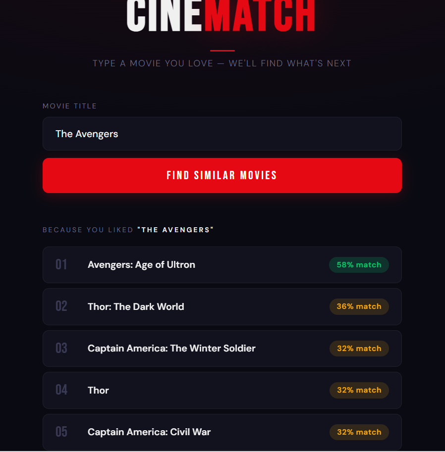
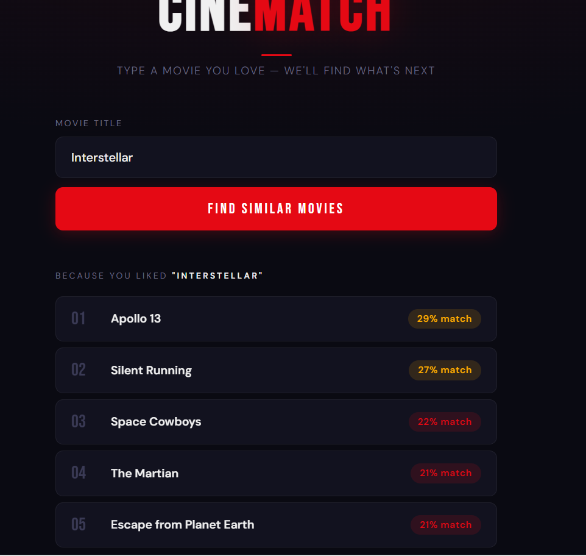
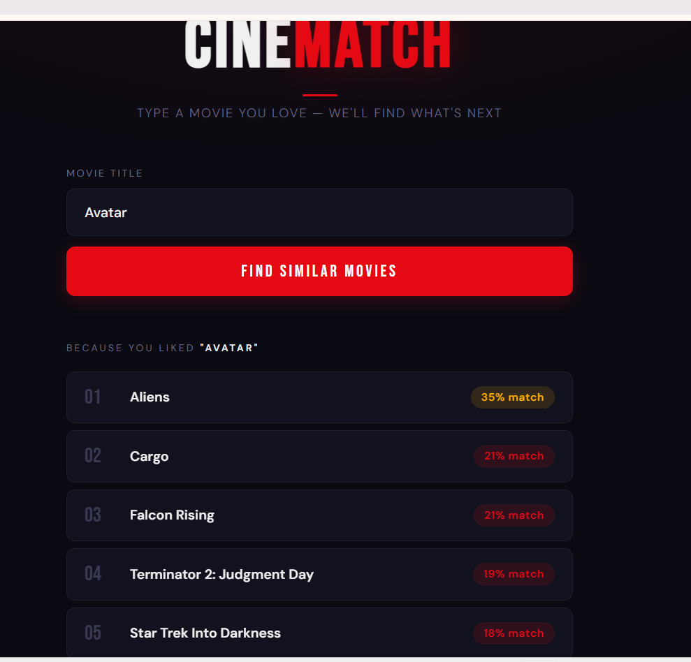
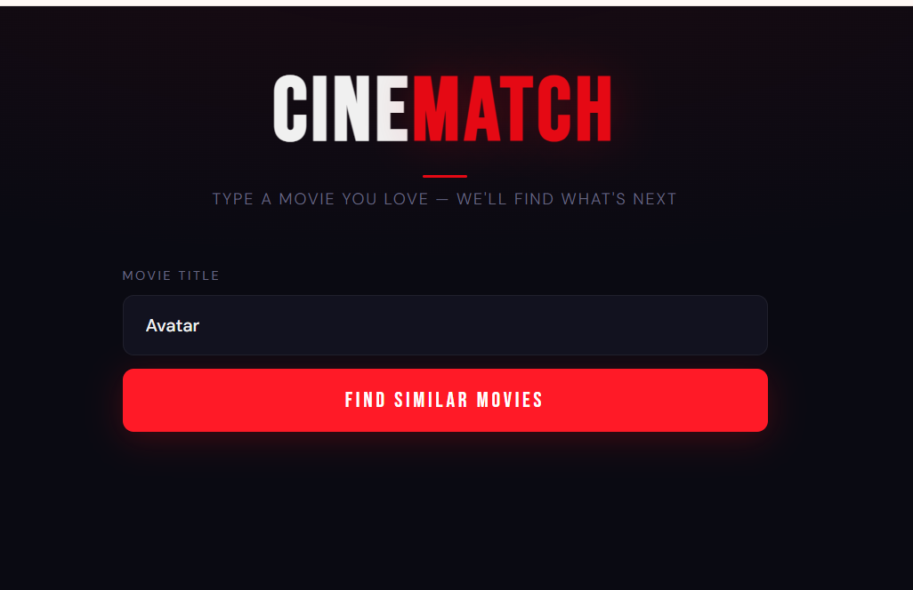

# 🎬 CineMatch — Movie Recommendation System
### A Complete Build Journal: Concepts, Decisions, and Lessons Learned

---

## Table of Contents
1. [What We Built](#what-we-built)
2. [Project Architecture](#project-architecture)
3. [Folder Structure](#folder-structure)
4. [Step 1 — Understanding the Data](#step-1--understanding-the-data)
5. [Step 2 — Merging & Cleaning](#step-2--merging--cleaning)
6. [Step 3 — Feature Engineering (Tags)](#step-3--feature-engineering-tags)
7. [Step 4 — Vectorization & Similarity](#step-4--vectorization--similarity)
8. [Step 5 — The Recommendation Function](#step-5--the-recommendation-function)
9. [Step 6 — Saving the Model](#step-6--saving-the-model)
10. [Step 7 — Flask Backend](#step-7--flask-backend)
11. [Step 8 — HTML/CSS Frontend](#step-8--htmlcss-frontend)
12. [Tuning Journey — Weight Experiments](#tuning-journey--weight-experiments)
13. [Key Concepts Reference](#key-concepts-reference)
14. [Lessons Learned](#lessons-learned)
15. [Tech Stack](#tech-stack)

---

## What We Built

A **content-based movie recommendation system** that:
- Takes any movie title as input
- Returns the top 5 most similar movies
- Displays results in a clean web UI with match percentages
- Shows a confidence warning when metadata is sparse

**Dataset:** TMDB 5000 Movies Dataset (Kaggle) — ~4800 movies with genres, keywords, cast, crew, and plot overviews.

---

## Project Architecture

```
User types movie name
        ↓
HTML/CSS/JS (templates/index.html)
        ↓  POST /recommend (JSON)
Flask Server (app.py)
        ↓  loads pre-computed pkl files
Similarity Matrix (artifacts/similarity.pkl)
        ↓
Returns top 5 similar movies as JSON
        ↓
JavaScript renders result cards in the browser
```

**Why two separate processes?**
- `recommender.py` = the **training** script. Runs once, takes ~10 seconds, writes pkl files.
- `app.py` = the **serving** script. Runs always, loads pkl instantly, serves requests in milliseconds.
- This separation is standard in production ML systems. Never re-train on every request.

---

## Folder Structure

```
movie-recommender/
│
├── artifacts/
│   ├── movies.pkl          ← clean dataframe (movie_id, title, tags)
│   └── similarity.pkl      ← 4803×4803 cosine similarity matrix
│
├── data/
│   ├── tmdb_5000_movies.csv    ← movie details (genres, keywords, overview)
│   └── tmdb_5000_credits.csv   ← cast and crew per movie
│
├── templates/
│   └── index.html          ← Flask looks here for HTML (Jinja2 convention)
│
├── recommender.py          ← data processing + model training
└── app.py                  ← Flask web server
```

---

## Step 1 — Understanding the Data

### What we loaded
Two separate CSV files that needed to be combined:

| File | Contents |
|------|----------|
| `tmdb_5000_movies.csv` | budget, genres, keywords, overview, title, etc. (20 columns) |
| `tmdb_5000_credits.csv` | cast, crew, movie_id, title (4 columns) |

### Key discovery
Columns like `genres`, `keywords`, `cast`, and `crew` were stored as **stringified JSON** inside CSV cells:
```
'[{"id": 28, "name": "Action"}, {"id": 12, "name": "Adventure"}]'
```
This is a **string** that looks like a list — pandas loads it as plain text. We needed to parse it into actual Python objects.

### Why the dataset has 4803 rows (not 5000)
Some movies were removed from the original TMDB database before the dataset was published.

---

## Step 2 — Merging & Cleaning

### Merging on `title`
```python
movies = movies.merge(credits, on='title')
```
Both files share the `title` column. After merging we got 23 columns with everything in one row per movie.

**Why dedup by `movie_id` not `drop_duplicates()`?**
Two movies can share a title (remakes!) but never the same ID. Using `subset='movie_id'` is the correct way to deduplicate by unique identity, not by content.

### Keeping only useful columns
We dropped 16 columns (budget, homepage, revenue, runtime, etc.) and kept only:
```
movie_id | title | overview | genres | keywords | cast | crew
```
Everything else is irrelevant for content-based similarity.

### Parsing stringified JSON — `ast.literal_eval`
```python
import ast

def convert(text):
    return [item['name'] for item in ast.literal_eval(text)]
```
`ast.literal_eval` converts a string that looks like a Python object into an actual Python object. Safer than `json.loads` because it only evaluates Python literals, not arbitrary code.

### Why only top 3 cast members?
A movie can have 50+ cast members. Minor roles don't define a movie's identity. The top 3 (ordered by billing) carry the real signal. More actors = noise that degrades similarity quality.

### Extracting the Director from Crew
The crew list contains everyone — directors, producers, composers, editors. We filtered specifically for `item['job'] == 'Director'` and returned only that name.

**Why return a list `[name]` instead of a string?**
All feature columns need the same data type (list of strings) so they can be concatenated cleanly in the next step.

---

## Step 3 — Feature Engineering (Tags)

This is the most important step — the "brain" of the system.

### Why collapse everything into one `tags` string?

The similarity algorithm (TF-IDF + Cosine Similarity) works on text. It needs one blob of words per movie. We combined all 5 feature lists into a single string that represents the movie's identity:

```
Avatar → "in the 22nd century a paraplegic marine... action adventure 
          sciencefiction cultureclash spacewar samworthington zoesaldana 
          jamescameron jamescameron jamescameron"
```

### Collapsing spaces in multi-word names
**Critical step.** `"Sam Worthington"` must become `"SamWorthington"` so it's treated as ONE unique token.

Without this: `"sam"` might match any movie with a character named Sam.
With this: `"SamWorthington"` only matches movies starring that specific actor.

```python
def collapse_spaces(lst):
    return [item.replace(" ", "") for item in lst]
```

### Lowercasing
All tags are lowercased so `"Action"` and `"action"` are treated as the same word. Always normalize text before processing.

### Stemming with PorterStemmer
```python
from nltk.stem.porter import PorterStemmer
ps = PorterStemmer()

def stem(text):
    return " ".join([ps.stem(word) for word in text.split()])
```

**Why stem?** Words like `"love"`, `"loved"`, `"loving"`, `"lover"` all mean essentially the same thing but are treated as completely different tokens without stemming. The Porter Stemmer reduces them all to their root: `"love"`. This dramatically improves matching, especially for overview text.

**Why stem AFTER joining into a string?** Stemming works word by word on a flat string. We already have a clean string at this point — much cleaner to apply in one pass.

### Feature weighting (Director × 3)
```python
movies['tags'] = (
    movies['overview']   +
    movies['genres'] * 2 +
    movies['keywords'] * 2 +
    movies['cast']       +
    movies['crew'] * 3      # director mentioned 3 times
)
```

**Why repeat features?** TF-IDF scores a word higher if it appears more frequently in a document. Repeating the director's name 3 times artificially boosts their importance in the similarity score. This is a simple but effective trick used in real production systems.

**Final weights after tuning:**
- `overview` × 1 (base signal)
- `genres` × 2 (important for genre-matching)
- `keywords` × 2 (thematic tags)
- `cast` × 1 (top 2 actors only)
- `crew (director)` × 3 (strongest signal for auteur films)

---

## Step 4 — Vectorization & Similarity

### The Problem: Computers Can't Read Words

You and I can feel similarity between "Action Sci-Fi JamesCameron" films. A computer only understands numbers. We need to convert words → numbers.

### TF-IDF Vectorization

```python
from sklearn.feature_extraction.text import TfidfVectorizer

tfidf = TfidfVectorizer(max_features=5000, stop_words='english')
vectors = tfidf.fit_transform(final['tags'])
# Result shape: (4803, 5000) — 4803 movies, each with 5000 features
```

**What is TF-IDF?**
- **TF (Term Frequency):** How often a word appears in THIS movie's tags
- **IDF (Inverse Document Frequency):** How rare the word is ACROSS ALL movies
- **TF × IDF:** Words that appear often in one movie but rarely overall get high scores

**Why TF-IDF instead of plain word counts?**
Plain counting gives high scores to common words like `"the"`, `"a"`, `"in"` — words that appear everywhere and tell us nothing about similarity. TF-IDF automatically rewards distinctive words (`"jamescameron"`, `"dreamheist"`) and penalizes common words.

**What does `stop_words='english'` do?**
Automatically removes common English words (the, a, in, is, and, etc.) from the vocabulary. These words would add noise without any signal.

**What does `max_features=5000` do?**
Limits the vocabulary to the 5000 most meaningful words. Without a cap, the vocabulary would be 20,000+ words — most of them noise. This keeps the matrix manageable and improves performance.

### Cosine Similarity

```python
from sklearn.metrics.pairwise import cosine_similarity

similarity = cosine_similarity(vectors)
# Result shape: (4803, 4803) — every movie compared to every other movie
```

**Why Cosine Similarity, not Euclidean Distance?**

Imagine two vectors pointing in the same direction (same themes/genres) but one is much longer (because the movie has a longer overview with more words). Euclidean distance would say they're far apart. Cosine similarity only cares about the **angle** between them — not their magnitude. This makes it robust to differences in overview length.

```
Cosine value of 1.0  →  identical movies
Cosine value of 0.0  →  nothing in common
```

**The result:** A 4803×4803 grid where `similarity[i][j]` is the similarity score between movie i and movie j.

---

## Step 5 — The Recommendation Function

```python
def recommend(movie_title):
    # 1. Find the row index of the movie
    movie_index = final[final['title'] == movie_title].index[0]
    
    # 2. Get all similarity scores for this movie vs every other movie
    distances = similarity[movie_index]
    
    # 3. Sort descending, skip index 0 (the movie itself, score = 1.0)
    movie_list = sorted(
        list(enumerate(distances)), 
        reverse=True, 
        key=lambda x: x[1]
    )[1:6]
    
    # 4. Return top 5
    return [{"title": final.iloc[i]['title'], "score": round(float(s), 3)} 
            for i, s in movie_list]
```

**Why `[1:6]` and not `[0:5]`?**
After sorting, index 0 is always the movie itself with a similarity of 1.0 (identical to itself). We skip it and take the next 5.

---

## Step 6 — Saving the Model

```python
import pickle

pickle.dump(final, open('artifacts/movies.pkl', 'wb'))
pickle.dump(similarity, open('artifacts/similarity.pkl', 'wb'))
```

**Why pickle?**
The similarity matrix is a NumPy array of 4803×4803 floats — not a CSV-friendly table. Pickle serializes any Python object (dataframes, numpy arrays, lists) directly to binary. Loading a pickle is near-instant vs. recomputing from scratch which takes 10+ seconds.

**The training vs. serving separation:**
- Run `recommender.py` once → generates pkl files
- `app.py` loads pkl files at startup → serves requests instantly
- Any time you change weights or features → re-run `recommender.py` FIRST, then restart `app.py`

> ⚠️ **Common mistake:** Editing `recommender.py` and restarting only `app.py`. The Flask server loads pkl files at startup — changing the code doesn't update what's in memory. You must always run `recommender.py` first, then `app.py`.

---

## Step 7 — Flask Backend

```python
from flask import Flask, render_template, request, jsonify
import pickle

app = Flask(__name__)

movies     = pickle.load(open('artifacts/movies.pkl', 'rb'))
similarity = pickle.load(open('artifacts/similarity.pkl', 'rb'))

@app.route('/')
def home():
    return render_template('index.html', movies=sorted(movies['title'].tolist()))

@app.route('/recommend', methods=['POST'])
def get_recommendations():
    data  = request.get_json()
    title = data.get('title', '')
    results = recommend(title)
    return jsonify({'recommendations': results})
```

**Why two routes?**
- `/` serves the HTML page with the movie list baked in (Jinja2 template)
- `/recommend` is an API endpoint — JavaScript calls it silently in the background without reloading the page (AJAX)

**Why `jsonify`?**
The browser and Python can't pass objects directly. JSON is the universal language of the web. We convert our Python list of dicts into JSON so JavaScript can read it.

**Why `render_template`?**
Flask looks inside the `templates/` folder by convention. Passing `movies=movie_list` lets us use `{{ movies | tojson }}` in the HTML to embed all 4803 titles directly into the JavaScript — enabling client-side autocomplete without any extra API calls.

---

## Step 8 — HTML/CSS Frontend

### Architecture of the UI
```
User types in #search input
        ↓
JS filters ALL_MOVIES array (4803 titles, pre-loaded)
        ↓
Shows matching titles in #dropdown
        ↓
User clicks a title → selectedMovie is set, button enabled
        ↓
User clicks "Find Similar Movies"
        ↓
fetch('/recommend', { method: 'POST', body: JSON.stringify({title}) })
        ↓
Response arrives → JS renders result cards dynamically
```

### Key frontend concepts used

**Autocomplete without a server call**
All 4803 movie titles are embedded in the page via Jinja2 (`{{ movies | tojson }}`). The JavaScript filters this local array on every keystroke. No round-trip to the server needed — instant filtering.

**AJAX (Async/Await fetch)**
The recommendation call happens in the background without a page reload:
```javascript
const res  = await fetch('/recommend', {
    method: 'POST',
    headers: { 'Content-Type': 'application/json' },
    body: JSON.stringify({ title: selectedMovie })
});
const data = await res.json();
```

**Color-coded match scores**
```javascript
function scoreClass(score) {
    if (score >= 0.40) return 'score-high';    // green
    if (score >= 0.25) return 'score-medium';  // amber
    return 'score-low';                         // red
}
```
Gives users instant visual feedback on confidence level.

**Confidence warning**
When all scores are below 25%, a warning banner appears:
```javascript
if (maxScore < 0.25) {
    // show warning: "Limited metadata available..."
}
```
This is honest product design — telling users when the system is less certain.

---

## Tuning Journey — Weight Experiments

This is the real story of how we arrived at the final weights.

### Experiment 1 — Director × 3, everything else × 1
```python
movies['tags'] = (
    movies['overview'] + movies['genres'] + movies['keywords'] +
    movies['cast'] + movies['crew'] * 3
)
```
**Results:**
- ✅ Inception → The Prestige, Memento, Interstellar (all Nolan) — excellent
- ✅ Avatar → Aliens, True Lies, Terminator 2 (all Cameron) — excellent
- ❌ Me Before You → Lottery Ticket, B-Girl — weak (15-18%)
- ⚠️ How to Lose a Guy → correct genre but low scores

### Experiment 2 — Genres × 3, Keywords × 2, Director × 3
```python
movies['tags'] = (
    movies['overview'] + movies['genres'] * 3 + movies['keywords'] * 2 +
    movies['cast'] + movies['crew'] * 3
)
```
**Results:**
- ✅ The Avengers → Age of Ultron, Thor, Civil War (all Marvel) — great
- ✅ The Notebook → strong romance/drama results — improved
- ❌ Avatar → lost Cameron films, became generic sci-fi
- ⚠️ Inception → scores dropped significantly

**Lesson learned:** Boosting genres too high overwrites the director signal for auteur-driven films.

### Final Configuration — Balanced Middle Ground
```python
movies['tags'] = (
    movies['overview']   +
    movies['genres'] * 2 +
    movies['keywords'] * 2 +
    movies['cast']       +
    movies['crew'] * 3
)
```
**Best overall balance:** Strong for director-driven films AND genre-driven films.

### The Fundamental Trade-off
> There is no perfect weight configuration. Every weight change helps one group and hurts another. This is the **bias-variance trade-off** in feature engineering.

- Higher genre weight → Better for: Romance, Comedy, Marvel franchises
- Higher director weight → Better for: Nolan, Cameron, auteur directors
- The goal is a globally acceptable balance, not perfection for any one case

### Why "Me Before You" is an unsolvable case
After investigating the raw data, this film had almost no keywords and very generic genre tags in the TMDB dataset. No weight tuning can fix missing data. The solution: show a confidence warning to the user instead of pretending the results are reliable. **"Garbage in, garbage out" is the most important rule in ML.**

---

## Key Concepts Reference

### Content-Based Filtering
Recommends based on properties of the item itself (genres, cast, director, plot). Does NOT require user history. Fully explainable: "Recommended because same director/genre."

### Collaborative Filtering (not used, but important to know)
Recommends based on patterns across many users: "Users who liked X also liked Y." Catches what content-based misses but requires user rating data.

### TF-IDF (Term Frequency — Inverse Document Frequency)
Converts text into numerical vectors. Rewards words that are frequent in one document but rare across all documents. Penalizes common words.

### Cosine Similarity
Measures the angle between two vectors. Value of 1.0 = identical, 0.0 = no overlap. Preferred over Euclidean distance for text because it's length-independent.

### Stemming
Reduces words to their root form. `loving → love`, `played → play`. Improves matching by treating morphological variants as the same word.

### Feature Weighting
Repeating a feature in the tags string inflates its TF-IDF score, giving it more influence on similarity. A simple but effective technique for boosting important signals.

### Pickle (Model Serialization)
Python's built-in way to save any object to disk and reload it instantly. Used to save the similarity matrix so Flask doesn't recompute it on every request.

### Train/Serve Separation
Training (building the model) and serving (using the model) are always separate processes. Training is slow and happens once. Serving is fast and happens on every request.

---

## Lessons Learned

1. **Data quality matters more than algorithm quality.** "Me Before You" had poor metadata — no algorithm can compensate for missing data.

2. **Feature engineering is the real work.** Getting genres, cast, director, and keywords combined into meaningful tags was more impactful than choosing between algorithms.

3. **Feature weighting is iterative.** You tune, test, observe, tune again. There's no formula — it requires experimentation.

4. **Bias-variance trade-off is everywhere.** Every change that helps one class of movies hurts another. The goal is a globally good balance.

5. **Training and serving must be separated.** The most common mistake: editing the model and forgetting to restart the server. Always run `recommender.py` before `app.py`.

6. **Honest UX is good engineering.** When the system is uncertain, tell the user. The confidence warning is better than showing bad recommendations without context.

7. **Cosine similarity > Euclidean for text.** Text vectors of different lengths should be compared by angle, not by distance.

8. **Collapsing name spaces is critical.** Without turning "Sam Worthington" into "SamWorthington", the word "Sam" could match unrelated movies. Always make multi-word entities into single tokens.

---

## Tech Stack

| Tool | Purpose |
|------|---------|
| `pandas` | Data loading and manipulation |
| `ast` | Parsing stringified JSON inside CSV cells |
| `nltk (PorterStemmer)` | Word stemming |
| `scikit-learn TfidfVectorizer` | Text → numerical vectors |
| `scikit-learn cosine_similarity` | Computing similarity between all movie pairs |
| `pickle` | Saving/loading the model to disk |
| `Flask` | Python web server / API |
| `Jinja2` | HTML templating (built into Flask) |
| `HTML/CSS/JS` | Frontend UI |

---

## 📸 Website Screenshots

### Search Interface


### Movie Dropdown


### Recommendations Results


### Full View


---

## How to Run

```bash
# 1. Install dependencies
pip install pandas numpy scikit-learn nltk flask

# 2. Train the model (run once, or whenever you change features/weights)
python recommender.py

# 3. Start the web server
python app.py

# 4. Open in browser
http://127.0.0.1:5000
```

> ⚠️ Always run step 2 before step 3. Always restart step 3 after re-running step 2.

---

*Built step by step, concept by concept. Every decision documented above.*